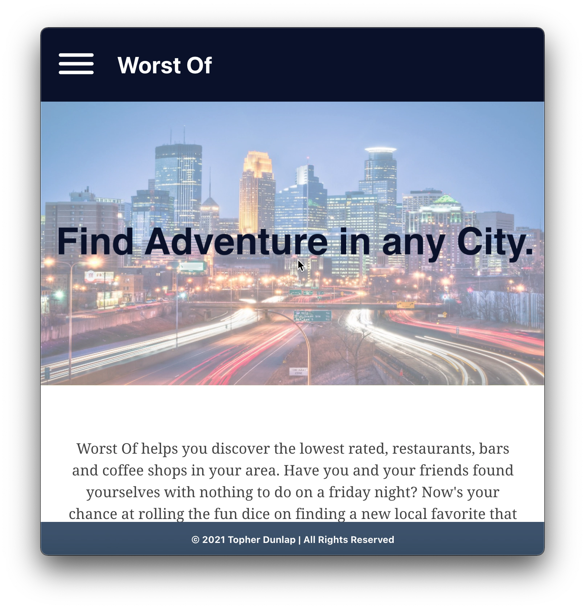

https://worst-of-client-4s5nnyjyl.vercel.app/

# Worst-Of

This app allows the user to search for the worst Restaurants, bars or coffee establishments in a given area.
The users default location will be determined via their IP address.
Their city will be automatically populated into the search bar for ease fo use.
The worst rated businesses will be returned, parsed and displayed from the Yelp Fusion API. 
If a given area does not have enough results to return the number will be adjusted automatically and re-requested for the max number of results possible.
Results display the default picture of the business, URL to the businesses Yelp page, overall rating, a user review, link to user review, user photo and address which will route you to google maps if clicked on.  Users will need to create an account in order to use the app features. 
However, there is a demo account available for users to test the functionality of the app. It is listed on the landing page for ease of use.
## Motivation

My motivation for this app was to create something that utilized client and server side technologies in an interesting way. It's common to see "best of" lists but never dynamic "Worst Of" list. In the age of experiences this type of app is exactly what Millennial's ordered.

## Screenshots
Landing Page:

Search:

Results:

## How to Use

1. Register an account or login using your own credentials or that of the Demo account.
2. Enter the city or area you'd like to see the Worst-Of results in.
3. Scroll through the results and interact with the different business or reviews. Conduct more searches to find more mediocrity!

## Built With

### Front-End
* React
* JSX
* JavaScript
* jQuery
* Jest
* Axios
* Service Objects
* Routing
* Error Boundaries
* JWT
* Hooks
* CSS

## Features

* Secure login and registration technology.
* Searches for the worst rates businesses in an area.
* Displays a review and photo for better insight into the business
* Dynamically displayed results
* interactive results with clickable links to extended reviews, yelp business page and google maps. 

## Authors

* **Topher Dunlap** - ** - Design, Front-End development/testing, styling, deployment and iteration.

